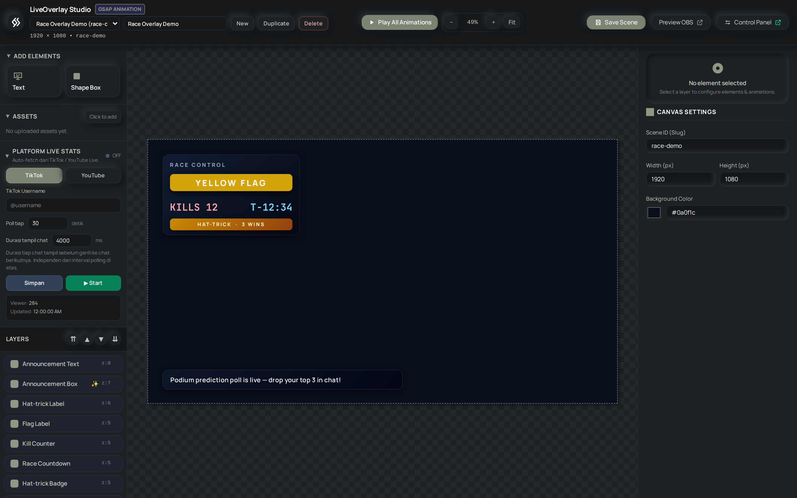
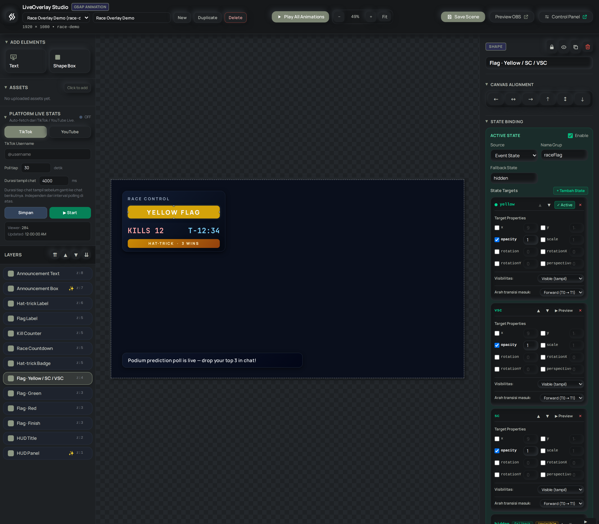
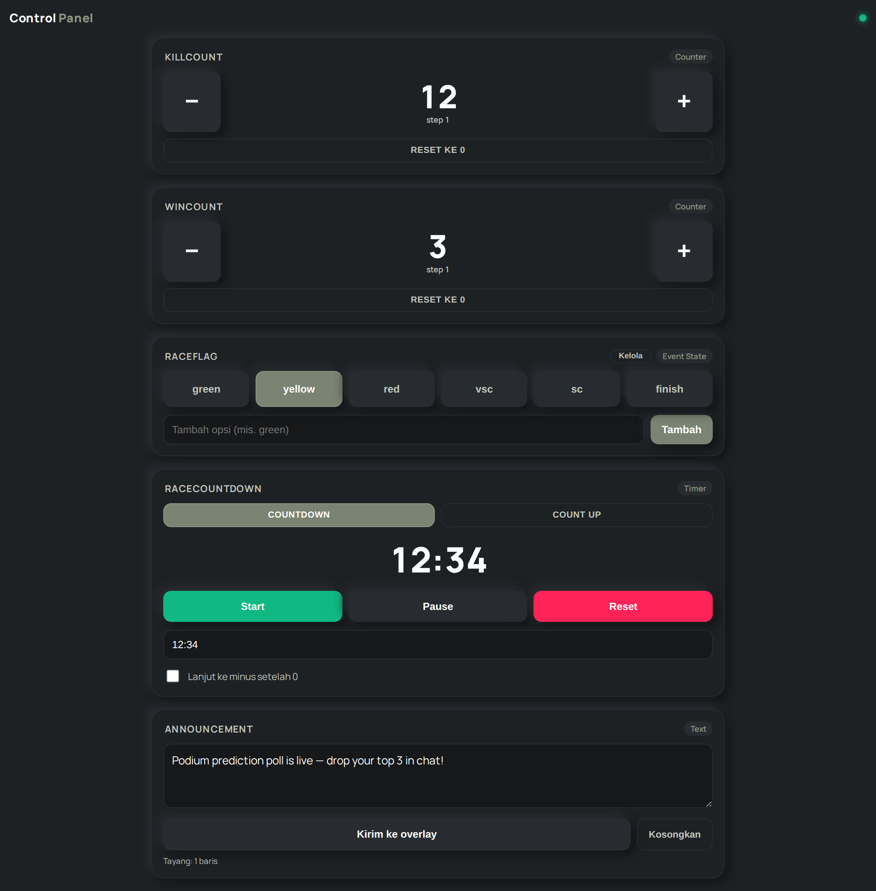

# 🎬 LiveOverlay Studio

**Versi: v1.1.0** · lihat [`CHANGELOG.md`](./CHANGELOG.md) untuk riwayat lengkap pengembangan.

**LiveOverlay Studio** adalah editor kanvas visual (mirip Canva/Figma versi ringan) untuk merancang overlay live streaming, ditenagai oleh **Bun**, **ElysiaJS**, **Tailwind CSS**, dan animasi **GSAP**.

Didesain khusus untuk live streamer (TikTok Live, YouTube, Twitch) yang ingin **menyusun sendiri komposisi visual overlay-nya** dari GUI — bukan sekadar isi form teks — lalu menampilkannya secara real-time sebagai OBS Browser Source, lengkap dengan animasi, aset custom (SVG/gambar), dan multi-scene untuk berbagai output sekaligus.

Prinsip utama: **WYSIWYG — What You See Is What You Stream**. Apa yang disusun di kanvas editor, itu juga persis yang tampil di overlay saat live.

---

## Screenshots

### Editor


### State Binding


### Control Panel


## ✨ Fitur Utama

- 🎨 **Canvas Editor Visual**: Drag & drop elemen langsung di kanvas — bukan lagi form statis. Mirip artboard di Illustrator/Figma, lengkap dengan panel Layers.
- 🧱 **Sistem Elemen & Layers**: Tambah elemen Text, Shape, dan Image/SVG. Setiap elemen bisa di-reorder (z-index), diduplikasi, disembunyikan, atau dihapus.
- 🎛️ **Panel Properti Lengkap**: Atur transform (posisi, ukuran, rotasi), style (warna, opacity, border, font), dan animasi per elemen langsung dari sidebar.
- 🌀 **State Binding & Animation Sequence per Elemen**: Bind elemen ke Event State atau Counter, atur target visual absolut per state, lalu gunakan sequence Enter dan Transition untuk mengatur cara perpindahannya. State hidden cukup memakai opacity 0; elemen tidak perlu dihapus dari DOM.
- 🔤 **Running Text (Adaptive Marquee)**: Elemen text bisa dibuat berjalan (ticker/marquee) dengan kecepatan konstan, arah, dan gap yang bisa diatur — cocok untuk teks berapapun panjangnya.
- 🔼 **Scroll Text (Up/Down)**: Varian vertikal dari Running Text — teks scroll ke atas/bawah, mode loop infinite atau yoyo (bolak-balik dengan jeda), cocok untuk credit roll atau reveal teks panjang.
- 📤 **Asset Management**: Upload SVG/PNG hasil desain sendiri (misal dari Illustrator), tersimpan di server, dan bisa dipakai berulang di elemen manapun.
- 🖥️ **Multi-Scene & Multi-Output**: Simpan banyak scene dengan ukuran kanvas (width/height) dan background masing-masing. Beberapa scene bisa dijalankan **bersamaan** di browser source berbeda — misalnya layout portrait untuk TikTok dan landscape untuk YouTube, sekaligus, tanpa saling mengganggu.
- 📊 **Platform Live Stats (TikTok/YouTube)**: Bind elemen text ke data live real-time — username, display name, viewer count, follower count, like count, hingga chat terbaru — via WebSocket (TikTok) dan Data API v3 (YouTube).
- 🏎️ **F1GStats Integration**: Bind elemen text ke data F1 (jadwal sesi & klasemen WDC/WCC) yang dibaca dari database SQLite lokal, hasil prefetch dari project Python terpisah — lihat [bagian F1GStats Integration](#f1gstats-integration) di bawah.
- 🔄 **Real-Time Auto Sync**: Overlay otomatis mendeteksi perubahan dari editor tanpa perlu refresh OBS Browser Source.
- 🔒 **Local Binding & Secure**: Server secara default hanya terikat ke `127.0.0.1` (localhost).
- 📦 **Zero CDN Dependency untuk CSS**: Tailwind CSS dikompilasi lokal untuk performa maksimal dan stabilitas offline/LAN.

---

## 📋 Prasyarat

Pastikan komputer Anda sudah terinstal **[Bun](https://bun.sh/)** (versi 1.1+).

Jika belum terinstal di Windows:
```powershell
powershell -c "irm bun.sh/install.ps1 | iex"
```

---

## 🚀 Instalasi & Menjalankan

1. **Clone repository & masuk ke folder:**
   ```bash
   git clone https://github.com/tyhad/LiveOverlay.git
   cd LiveOverlay
   ```

2. **Instal dependensi:**
   ```bash
   bun install
   ```

3. **Build aset CSS:**
   ```bash
   bun run build
   ```

4. **Jalankan Server Development:**
   ```bash
   bun run dev
   ```

Server akan aktif di: **`http://127.0.0.1:3000`**

## Arsitektur Visual

`DESIGN.md` adalah referensi desain lokal pribadi yang tidak disimpan di repo. Sumber kebenaran token desain untuk kontributor adalah `public/design.css`.

- `public/styles.css`: output build Tailwind dari `src/styles/input.css`; jangan diedit manual.
- `public/design.css`: design tokens bersama dan styling Control Panel dengan scope `.control-page`.
- `public/editor.css`: styling editor utama dengan scope `.editor-page`.
- Status tetap semantik: hijau untuk aktif/berhasil dan merah untuk error/stop.

Perubahan visual sebaiknya dilakukan di stylesheet scoped tersebut agar tidak tertimpa oleh `bun run build:css`.

---

## 🎮 Panduan Penggunaan

### 1. Membuka Editor

Buka web browser Anda dan akses:
👉 **[http://localhost:3000](http://localhost:3000)**

Di sini Anda bisa:
- Menambahkan elemen (Text, Shape, Image/SVG) ke kanvas lewat drag & drop.
- Mengatur posisi, ukuran, warna, dan animasi tiap elemen lewat panel Properti di sidebar kanan.
- Mengatur **Canvas Settings** per scene (ukuran width/height, background color) — klik area kosong kanvas (tanpa elemen terpilih) untuk membuka panel ini.
- Mengelola beberapa **Scene** (buat baru, duplikat, rename, hapus) lewat scene selector di toolbar atas.
- Meng-upload aset SVG/gambar sendiri lewat panel Assets.

Perubahan tersimpan otomatis / lewat tombol Save, dan langsung ter-refresh di overlay yang sedang berjalan.

### 2. Memasang Overlay di OBS Studio

1. Buka **OBS Studio**.
2. Pada panel **Sources**, klik tombol **`+`** lalu pilih **Browser** (Browser Source).
3. Beri nama source (misalnya: `LiveOverlay — Scene Default`).
4. Atur properti Browser Source sebagai berikut:
   - **URL**: `http://localhost:3000/overlay.html?scene=default` (ganti `default` dengan ID scene yang ingin ditampilkan)
   - **Width / Height**: sesuaikan dengan ukuran kanvas scene tersebut (lihat Canvas Settings di editor)
   - **Custom CSS**: *(Biarkan kosong atau default)*
   - **Shutdown source when not visible**: Centang (opsional)
   - **Refresh browser when scene becomes active**: Centang (opsional)
5. Klik **OK**. Overlay transparan akan muncul di kanvas OBS dengan animasi GSAP yang halus, sesuai desain yang Anda susun di editor.

**Multi-output**: Untuk menampilkan scene berbeda secara bersamaan (misal portrait TikTok + landscape YouTube), tambahkan Browser Source baru dengan `?scene=` yang berbeda. Setiap instance overlay independen dan tetap tersinkron real-time.

---

## 🛠️ Perintah Script yang Tersedia

| Command | Keterangan |
| :--- | :--- |
| `bun run dev` | Menjalankan server backend dalam mode watch |
| `bun run dev:css` | Menjalankan watch compiler untuk Tailwind CSS |
| `bun run build` | Mengompilasi Tailwind CSS (`src/styles/input.css` ke `public/styles.css`) |
| `bun run build:css` | Mengompilasi `src/styles/input.css` ke `public/styles.css` secara langsung |
| `bun start` | Menjalankan server dalam mode produksi |
| `bun run test` | Menjalankan seluruh regression test: Animation Engine, Control State, migrasi scene lama, dan integrasi overlay. Test integrasi overlay memakai `node --test` (jsdom belum kompatibel dengan runner Bun), jadi **Node.js 20+** perlu terpasang |
| `bun run test:overlay` | Hanya test integrasi overlay (state binding, visibilitas per state, arah transition) |

---

## 🔒 Konfigurasi & Keamanan

### Fase 10 — Text, 3D, Current Time, dan Control Panel

Fase 10 mencakup 10.1 Text Drop Shadow, 10.2 RotateX/Y/Z + Perspective, 10.3 Current Time, dan 10.4 Control Panel: Counter, Event State, Timer, Text. Control Panel tersedia di `/control`, endpoint baru berada di `/api/control-state/*`, dan state disimpan di `control-state.json` dengan template `control-state.example.json`.

Perbaikannya mencakup serialisasi mutasi dan cache in-memory, validasi nama grup reserved, fallback file korup, Restart/Resume timer, serta pencegahan re-render tombol saat angka timer berubah.

### Data Scene

Aplikasi menyimpan seluruh data scene (elemen, posisi, style, animasi, ukuran kanvas) di `scenes.json` (diabaikan oleh git). Lihat contoh format di [`scenes.example.json`](./scenes.example.json).

Contoh URL overlay untuk scene tertentu:

```text
http://localhost:3000/overlay.html?scene=portrait-chat
```

### F1GStats Integration

Binding data F1 (jadwal sesi & klasemen WDC/WCC) dibaca **read-only** dari file `f1gstats.sqlite`, hasil prefetch project **F1GStats** — project Python terpisah dengan repo git sendiri, tidak termasuk di repo ini. Path file diasumsikan sejajar folder ini (`../F1GStats/f1gstats.sqlite`), bisa di-override lewat env var `F1_DB_PATH`. Jalankan fetcher-nya secara manual sebelum sesi live:

```bash
py fetch_f1_data.py --season 2026 --output ./f1gstats.sqlite
```

Detail arsitektur & skema database ada di [`issue.md`](./issue.md) bagian "F1GStats Integration".

### Akses dari Perangkat Lain di LAN

Secara default server hanya mendengarkan `127.0.0.1`. Untuk mengaksesnya dari perangkat lain dalam Wi-Fi/LAN yang sama, buat file `.env` lokal:

```env
HOST=0.0.0.0
PORT=3000
SETTINGS_SECRET=kunci_rahasia_anda_disini
```

`HOST=0.0.0.0` membuat server menerima koneksi dari interface jaringan lokal. Buka `http://IP-DEVICE-SERVER:3000` dari perangkat lain. Gunakan `SETTINGS_SECRET` untuk semua request yang mengubah data dengan header `Authorization: Bearer <secret>` atau `X-Secret-Token: <secret>`.

Editor dan Control Panel akan meminta secret saat aksi perubahan pertama dilakukan, lalu menyimpannya sementara selama tab browser masih terbuka.

> ⚠️ `SETTINGS_SECRET` wajib diatur sebelum server dibuka ke LAN. File `.env` tidak masuk Git. Pengaturan ini ditujukan untuk jaringan lokal tepercaya, bukan internet publik; koneksi LAN ini belum menggunakan TLS.

---

## ⚠️ Known Limitations

- **Browser Source dimension tidak auto-sync** ke Canvas Settings scene — kamu perlu set manual dimensi Browser Source di OBS/TikTok Studio supaya sesuai ukuran scene (misal 1080×1920 untuk portrait).
- **Race condition minor** di penyimpanan scene (`persistSceneStore`) kalau dua penyimpanan terjadi nyaris bersamaan — belum jadi masalah nyata di pemakaian normal (personal-use, single editor session).
- File `f1gstats.sqlite` bisa ter-lock oleh proses lain saat fetcher F1GStats jalan bersamaan server LiveOverlay masih aktif (khususnya di Windows) — stop server dulu sebelum re-run fetcher.

Detail & status lengkap ada di [`issue.md`](./issue.md).

---

## 📁 Struktur Proyek

```text
LiveOverlay/
├── public/
│   ├── index.html            # Canvas Editor (GUI utama)
│   ├── overlay.html          # Transparent OBS Browser Source Overlay (player)
│   ├── animation-engine.js   # Modul Animation Sequence Engine (dipakai bersama editor & overlay)
│   └── styles.css            # Compiled Tailwind CSS
├── src/
│   ├── index.ts              # ElysiaJS Backend Server & API Routes
│   ├── scene-migration.ts    # Migrasi otomatis scene lama (visibilityBinding / exitSequence / animation.sequence)
│   └── styles/input.css      # Tailwind CSS entry directive
├── tests/
│   ├── animation-engine.test.mjs  # Regression test untuk Animation Sequence Engine
│   ├── control-state.test.mjs     # Test Control Panel state (counter, timer, persistence)
│   ├── overlay-state.test.mjs     # Test integrasi overlay.html di jsdom (jalan via Node)
│   └── scene-migration.test.mjs   # Test migrasi scene lama ke model State Binding
├── scenes.example.json       # Template data scene
├── settings.example.json     # Template konfigurasi platform live stats
├── live-stats.example.json   # Template cache data live stats
├── f1-text-templates.example.json # Template format teks F1GStats (custom text templates)
├── Vision.md                 # Visi produk, pilar fitur, arsitektur & prinsip desain (jarang berubah)
├── issue.md                  # Backlog & technical debt aktif (selalu up-to-date)
├── CHANGELOG.md              # Riwayat lengkap pengembangan tiap fase
├── package.json              # Project dependencies & scripts
├── tsconfig.json             # TypeScript configuration
└── README.md                 # Dokumentasi proyek
```

Untuk detail visi produk & arsitektur, lihat [`Vision.md`](./Vision.md). Untuk backlog & status implementasi terkini, lihat [`issue.md`](./issue.md). Untuk riwayat pengembangan lengkap, lihat [`CHANGELOG.md`](./CHANGELOG.md).

---

## 🤝 Dibangun Dengan Bantuan

Proyek ini dikembangkan secara iteratif dengan bantuan AI coding assistant, termasuk:

- **[Claude](https://claude.com)** (Anthropic)
- **Antigravity CLI**
- **Codex CLI**

---

## 📄 Lisensi

Proyek ini dibuat untuk keperluan personal/komunitas streaming. Bebas digunakan dan dimodifikasi.